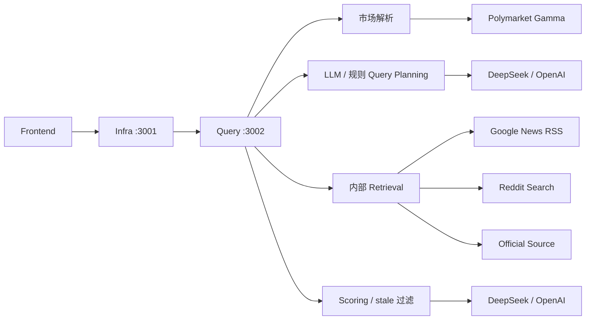
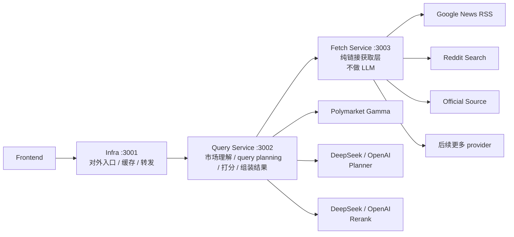

# 数据获取层拆分设计（PRD / Architecture Draft）

## 背景

当前推荐链路虽然已经拆成了：

- `infra`：对外 API、缓存、内部转发
- `query`：市场解析、query planning、检索、打分、响应组装

但“信息源获取”这一段仍然内嵌在 `query` 服务内部。

这会带来几个问题：

1. `query` 层同时负责：
   - 市场理解
   - query planning
   - provider 选择
   - 外部检索
   - 结果打分
   - 结果过滤
2. 检索相关问题难以定位：
   - 是 query 规划错了
   - 是 provider 请求失败了
   - 是 provider 本身没结果
   - 还是后续 stale 过滤掉了
3. LLM 逻辑与检索执行逻辑耦合在同一服务里，不利于后续扩展。
4. 如果以后要增加新的 source provider、做 provider routing、引入不同市场题材的差异化检索策略，当前 `query` 层会越来越重。

因此需要把“最低级别的信息源链接获取”单独拆成一个新的内部层。

---

## 目标

新增一个独立的 **数据获取层**（Fetch Layer / Fetch Service），通过 `localhost` 与 `query` 层通信。

### 这个新层只做什么

- 接收来自 `query` 层的“检索任务”
- 根据题材、市场类型、时间敏感性、官方来源等信息选择合适的 provider 组合
- 从外部 source provider 获取最低级别链接
- 返回结构化候选结果与 provider 诊断

### 这个新层明确不做什么

- 不做 LLM query planning
- 不做 LLM rerank
- 不做市场语义分析或最终排序
- 不做 stale 过滤
- 不负责最终对外 API 格式

也就是说：

- `query` 决定“搜什么”
- `fetch` 决定“去哪搜、怎么搜”

---

## 非目标

这次拆分的目标不是：

- 一次性引入全文抓取 / 网页正文抽取
- 一次性支持几十个 provider
- 一次性把评分和召回都重做
- 一次性改变现有对外 API 契约

第一阶段只要求：

- 把“候选链接获取”从 `query` 层独立出去
- 建立稳定的 localhost 内部通信
- 让 provider 失败、空结果、召回数量等信息能被独立观察

---

## 当前架构



### 当前问题

- 检索层只是 `query` 内部一个模块，不是独立服务
- provider 失败会影响 `query` 层定位
- 检索职责和 LLM 职责仍混在同一业务层里

---

## 目标架构



---

## 分层职责

### 1. `infra`

职责：

- 对外暴露公开 API
- 请求参数基础校验
- Mongo 请求缓存
- 向内部 `query` 服务转发

不负责：

- query planning
- provider 调度
- 链接检索
- 排序与过滤

### 2. `query`

职责：

- 解析请求体
- 解析市场输入（Polymarket 标识 / 自定义市场）
- 生成 query planning
- 将市场语义、题材信息、时效信息、官方来源等下发给 `fetch`
- 对 `fetch` 返回的候选源进行 scoring / rerank / stale 过滤
- 组装最终响应

不负责：

- 직접访问 Google News / Reddit 等 provider
- provider 级失败处理细节

### 3. `fetch`

职责：

- 只做最低级候选链接获取
- 根据请求特征选择 provider 组合
- 执行 provider 级请求
- 返回候选列表和 provider 级诊断信息

不负责：

- LLM
- 相关性最终判断
- stale 过滤
- 最终对外推荐结果

---

## Query 与 Fetch 的边界

### Query 传给 Fetch 的内容

`fetch` 层不应该只接收一个“裸 query 字符串”，而应该接收一份结构化的检索上下文。

建议最小输入：

```json
{
  "market": {
    "question": "Will Trump tweet today?",
    "description": "optional",
    "resolution_source": "optional",
    "market_type": "social-personal-activity",
    "time_sensitivity": "high"
  },
  "search_plan": {
    "queries": [
      "Will Trump tweet today?",
      "Trump tweet today",
      "Trump Truth Social post today"
    ],
    "query_source": "llm"
  },
  "fetch_hints": {
    "prefer_official": true,
    "prefer_social": true,
    "prefer_news": true,
    "max_candidates": 20
  }
}
```

### Fetch 返回给 Query 的内容

建议最小输出：

```json
{
  "candidates": [
    {
      "title": "Example title",
      "url": "https://example.com",
      "snippet": "optional",
      "provider": "google_news",
      "source_type": "news",
      "published_at": "2026-05-19T00:00:00.000Z"
    }
  ],
  "fetch_meta": {
    "provider_stats": [
      {
        "provider": "google_news",
        "query_count": 3,
        "candidate_count": 4,
        "failed_query_count": 0
      }
    ]
  }
}
```

---

## “根据题材和市场做不同信息源获取特色”是什么意思

这里的重点不是让 `fetch` 做市场理解，而是让 `query` 先把市场理解结果结构化，再下发给 `fetch`。

### 例子 1：政治人物社交行为类

如：

- `Will Trump tweet today?`
- `Will Musk post about xAI this week?`

特点：

- 时间敏感性高
- 官方 / 半官方社交源价值高
- 一般新闻搜索不一定最有效

Fetch 策略：

- 提高 social / official provider 优先级
- 降低泛新闻依赖
- 允许更短时间窗口

### 例子 2：宏观 / 政策 / 财经事件类

如：

- `Will the Fed cut rates in June?`
- `Will BTC close above 120k this month?`

特点：

- 新闻与官方公告源更关键
- Reddit 只适合作为补充

Fetch 策略：

- 优先 news + official
- social 次要

### 例子 3：产品发布 / 公司动作类

如：

- `Will Apple launch ...`
- `Will OpenAI release ...`

特点：

- 新闻、官方博客、官网更新都重要

Fetch 策略：

- official + news
- 对已知域名可做 allowlist / boost

---

## 通信方式

### 端口建议

- `infra`: `3001`
- `query`: `3002`
- `fetch`: `3003`

### 通信方向

- `frontend -> infra`
- `infra -> query`
- `query -> fetch`

其中：

- `infra` 与 `query` 继续通过 localhost HTTP 通信
- `query` 与 `fetch` 也通过 localhost HTTP 通信

这样做的好处：

- 运行时拓扑简单
- 本地调试容易
- 与当前 launcher / fork 机制兼容
- provider 故障影响面更容易隔离

---

## 进程模型建议

第一阶段不要求把它部署成单独机器或容器。

建议仍保持：

- `backend/dist/main.js` 启动后
  - 启动 `infra`
  - fork `query`
  - fork `fetch`

这样部署方式基本不变，只是内部多一个 localhost 服务。

---

## 目录建议

建议新增如下结构：

```text
backend/src/
  apps/
    infra/
    query/
    fetch/
      main.ts
      fetch-app.module.ts
  fetch/
    api/
    domain/
    integration/
    fetch.module.ts
```

### `fetch/api`

- 内部 HTTP 接口
- 如 `POST /internal/fetch/candidates`

### `fetch/domain`

- fetch orchestration
- provider 路由策略
- request/response 组装

### `fetch/integration`

- `google-news.provider.ts`
- `reddit.provider.ts`
- `official-source.provider.ts`
- 后续更多 provider

---

## 第一阶段接口建议

### Query -> Fetch

`POST /internal/fetch/candidates`

请求体：

- 市场上下文摘要
- searchQueries
- fetchHints

响应体：

- `candidates`
- `fetch_meta`

### 为什么不直接透传 RecommendationRequest

因为 `fetch` 层不应该知道：

- Polymarket 标识解析规则
- LLM planner 细节
- 前端输入模式

它应该只处理“已经准备好的检索任务”。

---

## 失败与诊断

拆层后，推荐链路的失败可以更清楚地分层表达：

### Query 层失败

- market 解析失败
- planner 失败
- scoring 失败

### Fetch 层失败

- provider HTTP 失败
- provider 返回空
- provider 解析失败
- provider 限流

### 推荐响应中应保留的诊断

- `planning_meta`
- `retrieval_meta`（后续更名为 `fetch_meta` 也可）

这样前端看到空结果时，就能判断：

- 是 planner 没问题但 fetch 全空
- 是 fetch 有结果但都被 stale 干掉
- 还是 provider 根本失败了

---

## 实施顺序建议

### Phase 1

- 新建 `fetch` 服务
- 把 Google News / Reddit / Official Source 从 `query` 内部迁到 `fetch`
- `query` 改为通过 localhost HTTP 调用 `fetch`
- 保持当前最终响应契约不变

### Phase 2

- 在 `query` 层增加更明确的 `market_type` / `time_sensitivity` / `source_preference`
- `fetch` 根据这些 hints 做 provider routing

### Phase 3

- 增加更多 source provider
- provider 级缓存
- provider 级 timeout / retry / metrics

---

## 风险

1. 多一个内部服务后，系统拓扑更复杂  
   需要保证 launcher、健康检查、退出信号处理一致。

2. 如果 `query -> fetch` 契约设计太弱  
   未来仍会把市场理解逻辑泄漏到 `fetch` 层。

3. 如果 `fetch` 层做得过重  
   又会重新变成“半个 query 层”。

因此要严格控制：

- `query` 做语义和策略
- `fetch` 做 provider 执行

---

## 成功标准

满足以下条件，即可认为拆层成功：

1. `query` 层不再直接 import / 调用 Google News / Reddit provider
2. `fetch` 层不依赖任何 LLM 客户端
3. `query -> fetch` 通过 localhost 通信
4. 空结果时可以明确判断：
   - provider 失败
   - provider 空结果
   - scoring/stale 过滤
5. 对外 `POST /api/v1/recommendations` 契约保持兼容

